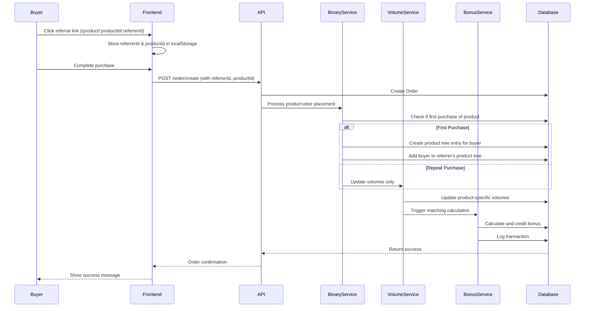

# Design Document: Product-Wise ML Binary Plan

## Overview

This design document describes the implementation of a Product-Wise ML Binary Plan system where each product maintains its own independent binary tree structure. Members can build separate networks for different products (Medicine, Pad, etc.), with each product having its own root member, volume tracking, and matching bonus calculations.

The system enables members to:
- Generate product-specific referral links
- Track purchases per product
- Build independent binary trees for each product
- Earn matching bonuses based on product-specific volumes
- View product-wise dashboard with binary tree visualization

## Architecture

### High-Level Architecture

```
┌─────────────────────────────────────────────────────────────┐
│                     Frontend (React)                         │
│  ┌──────────────┐  ┌──────────────┐  ┌──────────────┐      │
│  │   Product    │  │   Member     │  │   Binary     │      │
│  │   Sharing    │  │  Dashboard   │  │     Tree     │      │
│  │   Component  │  │  Component   │  │ Visualization│      │
│  └──────────────┘  └──────────────┘  └──────────────┘      │
└─────────────────────────────────────────────────────────────┘
                            │
                            ▼
┌─────────────────────────────────────────────────────────────┐
│                    API Layer (Express)                       │
│  ┌──────────────┐  ┌──────────────┐  ┌──────────────┐      │
│  │   Product    │  │    Order     │  │   Binary     │      │
│  │   Routes     │  │   Routes     │  │     Tree     │      │
│  │              │  │              │  │    Routes    │      │
│  └──────────────┘  └──────────────┘  └──────────────┘      │
└─────────────────────────────────────────────────────────────┘
                            │
                            ▼
┌─────────────────────────────────────────────────────────────┐
│                  Business Logic Layer                        │
│  ┌──────────────┐  ┌──────────────┐  ┌──────────────┐      │
│  │   Binary     │  │   Volume     │  │   Matching   │      │
│  │  Placement   │  │  Calculator  │  │    Bonus     │      │
│  │   Service    │  │   Service    │  │   Service    │      │
│  └──────────────┘  └──────────────┘  └──────────────┘      │
└─────────────────────────────────────────────────────────────┘
                            │
                            ▼
┌─────────────────────────────────────────────────────────────┐
│                   Data Layer (MongoDB)                       │
│  ┌──────────────┐  ┌──────────────┐  ┌──────────────┐      │
│  │   Member     │  │   Product    │  │    Order     │      │
│  │   Model      │  │    Model     │  │    Model     │      │
│  └──────────────┘  └──────────────┘  └──────────────┘      │
│  ┌──────────────┐  ┌──────────────┐                        │
│  │ Transaction  │  │   Product    │                        │
│  │    Model     │  │  BinaryTree  │                        │
│  └──────────────┘  └──────────────┘                        │
└─────────────────────────────────────────────────────────────┘
```

### Component Interaction Flow



## Components and Interfaces

### 1. Member Model (Enhanced)

```javascript
// server/models/memeberModel.js

const memeberSchema = new mongoose.Schema({
  // Existing fields
  fName: String,
  lName: String,
  userName: String,
  email: String,
  phone: Number,
  password: String,
  images: [{ public_id: String, url: String }],
  address: String,
  role: { type: String, enum: ["member", "admin"], default: "member" },
  tier: { type: String, enum: ["Bronze", "Silver", "Gold", "Platinum", "Diamond", "Blue Diamond"], default: "Bronze" },
  acc: String,
  ifsc: String,
  bankName: String,
  bankHolderName: String,
  sContact: Number,
  isActive: { type: Boolean, default: false },
  parent: { type: mongoose.Schema.Types.ObjectId, ref: "Memeber" },
  child: [{ type: mongoose.Schema.Types.ObjectId, ref: "Memeber" }],
  
  // NEW: Product-wise binary trees
  productBinaryTrees: [{
    productId: { 
      type: mongoose.Schema.Types.ObjectId, 
      ref: "Product",
      required: true 
    },
    
    // Binary tree structure for this product
    binaryPosition: {
      leftLeg: [{
        memberId: { type: mongoose.Schema.Types.ObjectId, ref: "Memeber" },
        joinedAt: { type: Date, default: Date.now },
        placementOrder: { type: Number } // Order in which they were placed
      }],
      rightLeg: [{
        memberId: { type: mongoose.Schema.Types.ObjectId, ref: "Memeber" },
        joinedAt: { type: Date, default: Date.now },
        placementOrder: { type: Number }
      }],
      
      // Current cycle volumes
      leftVolume: { type: Number, default: 0 },
      rightVolume: { type: Number, default: 0 },
      
      // Carry forward from previous cycles
      carryForward: {
        left: { type: Number, default: 0 },
        right: { type: Number, default: 0 }
      },
      
      // Statistics
      totalMatchedPairs: { type: Number, default: 0 },
      totalMatchingBonus: { type: Number, default: 0 },
      lastMatchingDate: { type: Date }
    },
    
    // Purchase history for this product
    purchases: [{
      orderId: { type: mongoose.Schema.Types.ObjectId, ref: "Order" },
      amount: { type: Number, required: true },
      quantity: { type: Number, default: 1 },
      purchaseDate: { type: Date, default: Date.now },
      referrerId: { type: mongoose.Schema.Types.ObjectId, ref: "Memeber" },
      isFirstPurchase: { type: Boolean, default: false }
    }],
    
    // Product-specific stats
    totalPurchases: { type: Number, default: 0 },
    totalSpent: { type: Number, default: 0 },
    firstPurchaseDate: { type: Date },
    lastPurchaseDate: { type: Date },
    isActive: { type: Boolean, default: false }, // Active in this product's binary
    
    // Referral stats for this product
    directReferrals: { type: Number, default: 0 },
    totalDownline: { type: Number, default: 0 }
  }],
  
  // Overall wallet and earnings
  wallet: { type: Number, default: 0 },
  totalEarnings: { type: Number, default: 0 },
  
  token: String,
  resetPasswordExpires: Date
}, { timestamps: true });
```

### 2. Product Model (Enhanced)

```javascript
// server/models/Product.js

const productSchema = new mongoose.Schema({
  // Existing fields
  title: { type: String, required: true, trim: true },
  description: { type: String, required: true },
  price: { type: Number, required: true },
  highPrice: { type: Number, required: true },
  images: [{ public_id: String, url: String }],
  sizes: String,
  slug: { type: String, unique: true, sparse: true },
  metaTitle: String,
  metaDescription: String,
  keywords: String,
  tags: String,
  
  // NEW: Binary tree configuration for this product
  binaryConfig: {
    rootMemberId: { 
      type: mongoose.Schema.Types.ObjectId, 
      ref: "Memeber",
      required: true 
    },
    matchingPercentage: {
      Bronze: { type: Number, default: 10 },
      Silver: { type: Number, default: 12 },
      Gold: { type: Number, default: 15 },
      Platinum: { type: Number, default: 18 },
      Diamond: { type: Number, default: 20 },
      "Blue Diamond": { type: Number, default: 22 }
    },
    isActive: { type: Boolean, default: true },
    totalMembers: { type: Number, default: 0 }, // Total members in this product's tree
    totalVolume: { type: Number, default: 0 } // Total sales volume for this product
  }
}, { timestamps: true });
```

### 3. Order Model (Enhanced)

```javascript
// server/models/Order.js

const orderSchema = new mongoose.Schema({
  user: { type: mongoose.Schema.Types.ObjectId, ref: "Memeber", required: true },
  
  shippingInfo: {
    name: { type: String, required: true },
    address: { type: String, required: true },
    city: { type: String, required: true },
    state: { type: String, required: true },
    other: String,
    pincode: { type: Number, required: true },
    phone1: { type: Number, required: true },
    phone2: { type: Number, required: true }
  },
  
  paymentInfo: {
    utr: { type: String, required: true }
  },
  
  orderItems: [{
    product: { type: mongoose.Schema.Types.ObjectId, ref: "Product", required: true },
    quantity: { type: Number, required: true },
    price: { type: Number, required: true }, // Price at time of purchase
    
    // NEW: Referral tracking per product
    referrerId: { type: mongoose.Schema.Types.ObjectId, ref: "Memeber" },
    isFirstPurchase: { type: Boolean, default: false },
    placedInLeg: { type: String, enum: ['left', 'right', 'none'], default: 'none' }
  }],
  
  paidAt: { type: Date, default: Date.now },
  month: { type: Number, default: new Date().getMonth() },
  totalPrice: { type: String, required: true },
  orderStatus: {
    type: String,
    enum: ['Ordered', 'Processing', 'Shipped', 'Delivered', 'Cancelled'],
    default: 'Ordered'
  }
}, { timestamps: true });
```

### 4. Transaction Model (New)

```javascript
// server/models/Transaction.js

const transactionSchema = new mongoose.Schema({
  memberId: { 
    type: mongoose.Schema.Types.ObjectId, 
    ref: "Memeber", 
    required: true 
  },
  
  productId: { 
    type: mongoose.Schema.Types.ObjectId, 
    ref: "Product", 
    required: true 
  },
  
  transactionType: {
    type: String,
    enum: ['matching_bonus', 'direct_referral', 'withdrawal', 'adjustment'],
    required: true
  },
  
  amount: { type: Number, required: true },
  
  description: { type: String },
  
  // For matching bonus transactions
  matchingDetails: {
    leftVolume: { type: Number },
    rightVolume: { type: Number },
    matchedVolume: { type: Number },
    matchingPercentage: { type: Number },
    carryForwardLeft: { type: Number },
    carryForwardRight: { type: Number }
  },
  
  // Reference to related order (if applicable)
  orderId: { type: mongoose.Schema.Types.ObjectId, ref: "Order" },
  
  status: {
    type: String,
    enum: ['pending', 'completed', 'failed'],
    default: 'completed'
  },
  
  balanceBefore: { type: Number },
  balanceAfter: { type: Number }
}, { timestamps: true });
```

## Data Models

### Member Product Tree Structure

```javascript
{
  _id: "member123",
  fName: "Ram",
  lName: "Kumar",
  userName: "ram_user",
  wallet: 5000,
  totalEarnings: 15000,
  
  productBinaryTrees: [
    {
      // Medicine Product Tree
      productId: "product_medicine_123",
      binaryPosition: {
        leftLeg: [
          { memberId: "member456", joinedAt: "2024-01-15", placementOrder: 1 },
          { memberId: "member789", joinedAt: "2024-01-20", placementOrder: 2 }
        ],
        rightLeg: [
          { memberId: "member101", joinedAt: "2024-01-18", placementOrder: 1 }
        ],
        leftVolume: 25000,
        rightVolume: 15000,
        carryForward: { left: 0, right: 0 },
        totalMatchedPairs: 3,
        totalMatchingBonus: 4500,
        lastMatchingDate: "2024-01-25"
      },
      purchases: [
        {
          orderId: "order123",
          amount: 5000,
          quantity: 2,
          purchaseDate: "2024-01-10",
          referrerId: "member000",
          isFirstPurchase: true
        }
      ],
      totalPurchases: 5,
      totalSpent: 25000,
      firstPurchaseDate: "2024-01-10",
      lastPurchaseDate: "2024-01-25",
      isActive: true,
      directReferrals: 3,
      totalDownline: 15
    },
    {
      // Pad Product Tree
      productId: "product_pad_456",
      binaryPosition: {
        leftLeg: [
          { memberId: "member202", joinedAt: "2024-01-12", placementOrder: 1 }
        ],
        rightLeg: [
          { memberId: "member303", joinedAt: "2024-01-14", placementOrder: 1 },
          { memberId: "member404", joinedAt: "2024-01-16", placementOrder: 2 }
        ],
        leftVolume: 10000,
        rightVolume: 20000,
        carryForward: { left: 0, right: 5000 },
        totalMatchedPairs: 2,
        totalMatchingBonus: 2000,
        lastMatchingDate: "2024-01-22"
      },
      purchases: [
        {
          orderId: "order456",
          amount: 3000,
          quantity: 1,
          purchaseDate: "2024-01-11",
          referrerId: "member000",
          isFirstPurchase: true
        }
      ],
      totalPurchases: 3,
      totalSpent: 9000,
      firstPurchaseDate: "2024-01-11",
      lastPurchaseDate: "2024-01-22",
      isActive: true,
      directReferrals: 2,
      totalDownline: 8
    }
  ]
}
```

### Product Configuration Structure

```javascript
{
  _id: "product_medicine_123",
  title: "Premium Medicine Pack",
  price: 2500,
  binaryConfig: {
    rootMemberId: "admin_member_001", // Root for medicine tree
    matchingPercentage: {
      Bronze: 10,
      Silver: 12,
      Gold: 15,
      Platinum: 18,
      Diamond: 20,
      "Blue Diamond": 22
    },
    isActive: true,
    totalMembers: 150,
    totalVolume: 375000
  }
}
```

## Correctness Properties

*A property is a characteristic or behavior that should hold true across all valid executions of a system—essentially, a formal statement about what the system should do. Properties serve as the bridge between human-readable specifications and machine-verifiable correctness guarantees.*

### Property 1: Binary Tree Placement Consistency

*For any* member and product, when a new member is placed in their binary tree, the placement should always be in the leg with fewer members, ensuring balanced tree growth.

**Validates: Requirements 1.3, 4.2, 4.3, 4.4**

### Property 2: Volume Propagation Completeness

*For any* purchase made through a referral link, the purchase amount should be added to the appropriate leg volume for all ancestors in the upline chain up to the root member for that product.

**Validates: Requirements 5.1, 5.2, 5.3, 5.4, 10.1, 10.2, 10.3, 10.4**

### Property 3: First Purchase Detection Accuracy

*For any* member and product combination, the system should correctly identify whether a purchase is the first purchase of that specific product, regardless of purchases of other products.

**Validates: Requirements 3.1, 3.2, 3.3**

### Property 4: Matching Bonus Calculation Correctness

*For any* member's product tree, the matching bonus should always be calculated as the minimum of (leftVolume + carryForward.left) and (rightVolume + carryForward.right), multiplied by the tier-specific matching percentage.

**Validates: Requirements 6.1, 6.2, 6.3, 11.2, 11.4**

### Property 5: Carry Forward Conservation

*For any* matching bonus calculation, the sum of (leftVolume + rightVolume) before matching should equal (matchedVolume * 2) + (carryForward.left + carryForward.right) after matching.

**Validates: Requirements 6.4, 6.5**

### Property 6: Product Tree Independence

*For any* two different products, changes to one product's binary tree (placements, volumes, bonuses) should not affect the other product's binary tree structure or calculations.

**Validates: Requirements 1.4, 9.2, 9.3**

### Property 7: Referral Link Uniqueness

*For any* product and referrer combination, the generated referral link should be unique and correctly encode both the product ID and referrer ID.

**Validates: Requirements 2.1, 2.2, 2.4**

### Property 8: Transaction Logging Completeness

*For any* matching bonus credited to a member's wallet, there should exist a corresponding transaction log entry with matching amount, product ID, and timestamp.

**Validates: Requirements 6.7, 12.1, 12.2**

### Property 9: Wallet Balance Consistency

*For any* member, the wallet balance should always equal the sum of all completed transaction amounts minus all withdrawals.

**Validates: Requirements 6.6, 12.5**

### Property 10: Root Member Initialization

*For any* product with a designated root member, the root member should have an initialized product tree entry with empty left and right legs and zero volumes.

**Validates: Requirements 8.1, 8.3, 8.4**

### Property 11: Upline Chain Termination

*For any* volume propagation operation, the recursion should terminate when reaching either the root member or a member without a parent, preventing infinite loops.

**Validates: Requirements 10.4, 15.4**

### Property 12: Multi-Product Order Processing

*For any* order containing multiple products, each product should be processed independently with separate volume updates, placements, and bonus calculations.

**Validates: Requirements 9.1, 9.2, 9.3, 9.4**

## Error Handling

### Error Scenarios and Handling Strategies

1. **Invalid Referrer ID**
   - Detection: Check if referrer exists in database before processing
   - Handling: Process purchase without referral tracking, log warning
   - User Impact: Purchase succeeds, no referral bonus generated

2. **Invalid Product ID**
   - Detection: Validate product ID against Product collection
   - Handling: Return 404 error with descriptive message
   - User Impact: Purchase fails, user notified to retry

3. **Self-Referral Attempt**
   - Detection: Compare referrer ID with buyer ID
   - Handling: Reject referral, process as direct purchase
   - User Impact: Purchase succeeds without referral bonus

4. **Circular Reference in Binary Tree**
   - Detection: Track visited members during upline traversal
   - Handling: Stop propagation, log error, alert admin
   - User Impact: Partial volume update, requires manual correction

5. **Database Transaction Failure**
   - Detection: Catch database errors during order creation
   - Handling: Rollback all changes, return error to user
   - User Impact: Purchase fails, user prompted to retry

6. **Concurrent Purchase Race Condition**
   - Detection: Use database transactions with isolation
   - Handling: Retry logic with exponential backoff
   - User Impact: Slight delay, eventual consistency

7. **Missing Product Tree Entry**
   - Detection: Check if product tree exists before volume update
   - Handling: Create product tree entry on-the-fly
   - User Impact: Transparent, no user-facing error

8. **Zero Volume Matching Calculation**
   - Detection: Check if both legs have zero volume
   - Handling: Skip matching calculation, return zero bonus
   - User Impact: No bonus credited (expected behavior)

9. **Wallet Insufficient Balance (for withdrawals)**
   - Detection: Compare withdrawal amount with wallet balance
   - Handling: Reject withdrawal, return error message
   - User Impact: Withdrawal fails, user notified

10. **Invalid Tier for Matching Percentage**
    - Detection: Validate tier exists in matching percentage config
    - Handling: Use default Bronze tier percentage
    - User Impact: Lower bonus percentage applied

## Testing Strategy

### Dual Testing Approach

The system will be validated using both **unit tests** and **property-based tests** to ensure comprehensive coverage:

- **Unit tests**: Verify specific examples, edge cases, and error conditions
- **Property tests**: Verify universal properties across all inputs using randomized test data

### Unit Testing Focus Areas

1. **Specific Examples**
   - Test placement of first member in empty binary tree
   - Test matching bonus calculation with known volumes
   - Test referral link generation with specific IDs

2. **Edge Cases**
   - Empty binary trees
   - Single-leg trees (only left or only right)
   - Zero volume scenarios
   - Maximum depth binary trees

3. **Error Conditions**
   - Invalid member IDs
   - Missing product configurations
   - Database connection failures
   - Concurrent modification conflicts

### Property-Based Testing Configuration

- **Framework**: fast-check (for JavaScript/Node.js)
- **Minimum iterations**: 100 per property test
- **Test tagging format**: `Feature: product-wise-ml-binary, Property {number}: {property_text}`

### Property Test Implementation Guidelines

Each correctness property will be implemented as a property-based test:

1. **Property 1 Test**: Generate random binary trees and verify balanced placement
2. **Property 2 Test**: Generate random purchase chains and verify volume propagation
3. **Property 3 Test**: Generate random purchase sequences and verify first purchase detection
4. **Property 4 Test**: Generate random volumes and verify matching calculation formula
5. **Property 5 Test**: Generate random matching scenarios and verify carry forward conservation
6. **Property 6 Test**: Generate random multi-product operations and verify independence
7. **Property 7 Test**: Generate random product/referrer pairs and verify link uniqueness
8. **Property 8 Test**: Generate random bonus credits and verify transaction logging
9. **Property 9 Test**: Generate random transaction sequences and verify wallet consistency
10. **Property 10 Test**: Generate random products and verify root initialization
11. **Property 11 Test**: Generate random upline chains and verify termination
12. **Property 12 Test**: Generate random multi-product orders and verify independent processing

### Integration Testing

- Test complete purchase flow from referral link to bonus credit
- Test dashboard API endpoints with real database
- Test concurrent purchases from multiple users
- Test upline propagation across multiple levels

### Performance Testing

- Test binary tree operations with 1000+ members
- Test volume propagation with 10+ upline levels
- Test matching calculations with large volume numbers
- Test dashboard queries with multiple products

### Test Data Generators

Property tests will use smart generators that:
- Generate valid member IDs from a pool
- Generate realistic purchase amounts (100-10000)
- Generate balanced and unbalanced binary trees
- Generate multi-level upline chains
- Constrain product IDs to valid test products
